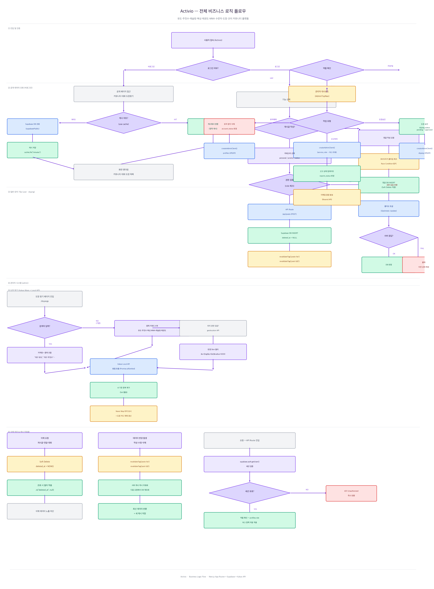

# Activio

> 유도·주짓수·레슬링·복싱·태권도·MMA — 모든 무술 종목 수련자·도장·코치를 하나의 공간에서 연결하는 스포츠 커뮤니티 플랫폼

배포 링크: https://final-project-team3.vercel.app/

---

## 개발 배경

무술을 배우고 싶어도 어디서 시작해야 할지 막막한 경험이 있었습니다. 도장을 찾으려면 지인에게 묻거나 검색 결과를 일일이 확인해야 했고, 막상 찾아가도 어떤 코치가 어떤 수업을 하는지 사전에 알 방법이 없었습니다.

수련자 입장에서 불편했던 건 두 가지였습니다. 하나는 정보 분산입니다. 유도·주짓수·복싱처럼 종목이 다르면 커뮤니티가 완전히 다른 곳에 흩어져 있어 공통 관심사를 가진 사람끼리 교류하기 어려웠습니다. 다른 하나는 검증 수단의 부재입니다. 도장의 실력과 분위기는 직접 방문하기 전까지 확인할 방법이 없었고, 초보자일수록 선택 기준이 없어 잘못된 곳에 등록하는 일이 반복됐습니다.

도장 운영자 쪽에서도 고충이 있었습니다. 홍보 채널이 없어 수련생을 모집하기 위해 각종 플랫폼을 개별 관리해야 했고, 대회 정보나 공지를 수련생에게 빠르게 전달하는 공식 수단이 없었습니다.

개발을 공부하면서 이 문제들을 시스템으로 풀어보고 싶었습니다. 종목별 커뮤니티에서 수련 경험과 기술을 공유하고, 도장이 홍보 게시글로 직접 수련생에게 다가가며, 대회 일정까지 한 곳에서 확인할 수 있다면 무술 생태계의 정보 비대칭이 줄어들 것이라고 봤습니다. Activio는 거기서 출발했습니다.

---

## 프로젝트 소개

| 항목 | 내용 |
|------|------|
| 배포 URL | https://final-project-team3.vercel.app/ |
| 개발 기간 | 2026.04 ~ 진행 중 |
| 개발 인원 | 4인 (풀스택) |

**테스트 계정**

| 역할 | 이메일 | 비밀번호 |
|------|--------|----------|
| 일반 유저 | user@test.com | test1234! |
| 도장 계정 | dojang@test.com | test1234! |
| 관리자 | admin@test.com | admin1234! |

---

## 시스템 아키텍처 및 비즈니스 로직 플로우



---

## 주요 기능 시연

### A. 종목별 커뮤니티 — 게시글 CRUD · 미디어 업로드 · 무한 스크롤

`/community/sport/[slug]` 경로로 종목별(유도·주짓수·레슬링·복싱·태권도·MMA) 커뮤니티가 분리됩니다. 로그인 사용자는 텍스트·이미지·동영상 게시글을 작성할 수 있고, 댓글·좋아요·북마크를 통해 상호작용합니다. 목록은 TanStack Query `useInfiniteQuery` 기반 무한 스크롤로 제공되며, 0.5초 디바운싱이 적용된 키워드 검색과 카테고리 필터를 지원합니다.

도장 계정(`role = 'dojang'`)은 `category = 'promo'` 홍보 게시글을 작성할 수 있고, 작성된 홍보글은 커뮤니티 좌측 `PromoAdSidebar`에 최대 5개까지 4초 자동 슬라이드로 노출됩니다.

### B. 도장 찾기 — 카카오 지도 · 종목별 키워드 병렬 검색

카카오 Maps API로 지도를 렌더링하고, 카카오 Local API로 도장을 검색합니다. 페이지 진입 시 유도·주짓수·복싱·MMA·레슬링·태권도 6개 종목 키워드로 병렬 호출 후 `id` 기준 중복 제거하여 전국 무술 도장을 기본 표시합니다. 위치 권한이 있으면 반경 5km 내 결과로 자동 전환됩니다. 검색창은 실시간 디바운스 검색으로 지역명과 종목명을 조합해 쿼리합니다.

카카오 REST API 키는 `KAKAO_REST_API_KEY` 서버 전용 환경변수에 저장하고, `NEXT_PUBLIC_` 접두사가 붙으면 브라우저 번들에 노출되기 때문에 API Route 프록시를 통해서만 호출합니다.

### C. 대회 일정 — 등록 · 상세 · 신청 링크

관리자와 도장 계정은 대회를 등록·수정·삭제할 수 있습니다. 목록은 모집 상태(모집중·마감임박·모집완료)와 무한 스크롤로 제공되며, URL 쿼리 파라미터로 탭 상태가 유지됩니다. 삭제는 Soft Delete(`deleted_at` 업데이트)로 처리하고, 조회 시 항상 `deleted_at IS NULL` 필터를 적용합니다.

### D. 관리자 시스템 — 유저 제재 · 도장 승인 · 신고 처리

관리자 전용 상단 네비게이션(`AdminTopNav`) 아래 게시글 관리·유저 관리·대회 관리·고객지원·대시보드 5개 섹션이 있습니다. 유저 정지·계정 삭제는 `service_role` 키를 사용하는 `createAdminClient()`를 통해 RLS를 우회하여 처리합니다. 도장 등록 승인은 `dojang_status`를 `pending → approved`로 변경하고, 신고 접수 시 관리자 이메일로 알림이 자동 발송됩니다.

관리자 테이블은 URL 쿼리 파라미터 기반 상태 관리와 Supabase `.range()`를 활용한 서버 페이지네이션으로 동작합니다.

---

## 기술 스택

**프레임워크 · 언어**

| 기술 | 선택 이유 |
|------|-----------|
| Next.js (App Router) | `use cache` 디렉티브 + `revalidateTag`로 공개 데이터를 정적 캐싱하고, 인증 데이터는 Suspense 스트리밍으로 분리 처리 |
| TypeScript (strict) | 역할 타입(`user`\|`dojang`\|`admin`), 게시글 카테고리, 운동 종목 슬러그 등 도메인 규칙을 타입 레벨에서 강제 |
| React 19 | 서버/클라이언트 컴포넌트 경계를 명확히 하여 TTI 최적화 |

**스타일**

| 기술 | 선택 이유 |
|------|-----------|
| Tailwind CSS v4 | `@custom-variant light`로 라이트 모드 오버라이드 구현, CSS 변수 토큰 기반 테마 시스템으로 하드코딩 없이 유지보수 |

**백엔드 · 데이터베이스**

| 기술 | 선택 이유 |
|------|-----------|
| Supabase (PostgreSQL) | RLS 정책으로 역할별 데이터 접근을 DB 레벨에서 통제, CHECK 제약으로 허용되지 않은 상태값 차단 |
| Supabase Auth | 이메일 기반 인증, 세션·토큰 관리, 역할별 분기 처리 |
| Supabase Storage | 게시글 이미지·동영상, 사업자등록증, 대회 이미지 버킷 분리 관리 |

**상태 관리**

| 기술 | 선택 이유 |
|------|-----------|
| TanStack Query v5 | 무한 스크롤(`useInfiniteQuery`), 낙관적 업데이트(좋아요), `HydrationBoundary`로 SSR 워터폴 방지 |
| Zustand | 인증 상태·모달 등 전역 UI 상태 관리, `useAuthStore` 단일 구독으로 불필요한 리렌더 방지 |
| Zod | 폼 스키마를 `schemas/`에 정의하고 `z.infer<>`로 TypeScript 타입과 동기화 |

**인프라 · 도구**

| 기술 | 선택 이유 |
|------|-----------|
| Vercel | main 브랜치 자동 배포, Edge Network CDN, 환경변수 격리 |
| Kakao Maps API | 국내 도로명 주소 정확도가 높고 지도 렌더링·마커 연동이 용이 |
| Kakao Local API | 키워드 기반 장소 검색, REST API 키를 서버 전용 환경변수로 분리해 클라이언트 노출 차단 |
| Resend | 신고 접수 알림 이메일 자동 발송 |

---

## 데이터베이스 설계 (ERD)

```
profiles      id · nickname · avatar_url · bio · belt_level(운동종목slug) · role(user|dojang|admin)
              name · email_value · phone_value · account_status
              도장 전용: business_number · representative · contact · address · business_file_url

posts         id · user_id → profiles · title · content
              category(notice|promo|personal) · sport(judo|bjj|wrestling|boxing|taekwondo|mma|NULL)
              image_url · video_url · view_count · report_count · status · deleted_at · created_at

comments      id · post_id → posts · user_id → profiles · content · deleted_at · created_at

likes         id · post_id → posts · user_id → profiles · created_at

bookmarks     id · post_id → posts · user_id → profiles · created_at
              복합 유니크: (user_id, post_id)

reports       id · reporter_id → profiles · post_id → posts
              reason · reports_status · handled_at · action_type · created_at

competition   id · user_id → profiles · name · location · event_data · apply_deadline
              apply_url · description · image_url · participants · deleted_at · created_at

dojang        id · profile_id → profiles · business_number · representative
              phone_value · addr · business_file_url · dojang_status · created_at
```

**설계 의도**

`posts.sport` 컬럼에 종목 슬러그(NULL 허용)를 두어 공지(`notice`)와 종목별 게시글을 단일 테이블에서 관리합니다. 종목 커뮤니티 조회 시 `sport = 'slug'` 필터로 분리하고, 공지는 `sport IS NULL`로 조회합니다.

`profiles.belt_level` 컬럼은 DB 마이그레이션 없이 운동 종목 슬러그를 저장하도록 재활용 중입니다. 별도 `sport` 컬럼으로 분리가 필요한 개선 항목입니다.

게시글·댓글·대회 삭제는 모두 Soft Delete(`deleted_at` 업데이트)로 처리합니다. 모든 조회 쿼리에 `deleted_at IS NULL` 필터가 반드시 포함되어야 하며, 누락 시 삭제 데이터가 클라이언트에 노출됩니다.

---

## 핵심 비즈니스 로직

### 1. 3-tier Supabase 클라이언트 분리

`use cache` 스코프 안에서는 `cookies()`를 호출할 수 없어 인증 클라이언트를 사용하지 못합니다. 목적별로 클라이언트를 세 가지로 분리해 이 제약을 해결했습니다.

```typescript
// lib/supabase/public.ts  — cookies() 없음, use cache 스코프에서 사용 가능
// lib/supabase/server.ts  — cookies() 있음, 인증 필요 서버 컴포넌트
// lib/supabase/admin.ts   — service_role key, RLS 우회 (서버 전용)

export function createAdminClient() {
  return createClient(
    process.env.NEXT_PUBLIC_SUPABASE_URL!,
    process.env.SUPABASE_SERVICE_ROLE_KEY!,  // NEXT_PUBLIC_ 없음 — 클라이언트 번들 미포함
  )
}
```

| 클라이언트 | cookies | use cache | 용도 |
|-----------|:-------:|:---------:|------|
| `supabasePublic` | 없음 | 가능 | 커뮤니티·대회·도장 공개 데이터 |
| `supabaseServer` | 있음 | 불가 | 마이페이지·글 작성 등 인증 필요 |
| `supabaseAdmin` | 없음 | — | 패널티 부여·도장 승인·신고 처리 |

### 2. `use cache` + `revalidateTag` 캐싱 전략

공개 데이터는 서비스 파일을 `.server.ts`로 분리하고 `use cache` 디렉티브를 적용합니다. 데이터 변경 시 `revalidateTag`로 즉시 무효화합니다.

```typescript
// services/communityService.server.ts
export async function getPosts(page?: number, pageSize?: number) {
  'use cache'
  cacheTag('posts-list')
  cacheLife('minutes')

  const supabase = createPublicSupabaseClient()
  return supabase
    .from('posts')
    .select('*, profiles(*), comments(count)')
    .is('deleted_at', null)
    .eq('status', 'published')
    .order('created_at', { ascending: false })
}

// API Route에서 캐시 무효화
revalidateTag('posts-list')
revalidateTag(`post-${id}`)
```

### 3. Soft Delete 패턴

게시글·댓글·대회 삭제는 실제 row를 제거하지 않고 `deleted_at` 컬럼을 업데이트합니다.

```typescript
// 삭제 — deleted_at 업데이트
await supabase
  .from('posts')
  .update({ deleted_at: new Date().toISOString() })
  .eq('id', id)

// 조회 — deleted_at IS NULL 필터 필수
await supabase
  .from('posts')
  .select('*')
  .is('deleted_at', null)
```

### 4. 역할 기반 접근 제어 (RBAC)

Supabase RLS 정책으로 DB 레벨에서 역할별 접근을 통제합니다.

| 기능 | user | dojang | admin |
|------|:----:|:------:|:-----:|
| 게시글 조회 | ✅ | ✅ | ✅ |
| 일반 게시글 작성 | ✅ | ✅ | ✅ |
| 홍보 게시글 작성 | ❌ | ✅ | ✅ |
| 공지 작성 | ❌ | ❌ | ✅ |
| 타인 게시글 삭제 | ❌ | ❌ | ✅ |
| 대회 등록·수정 | ❌ | ✅ | ✅ |
| 관리자 페이지 | ❌ | ❌ | ✅ |
| 유저 제재·도장 승인 | ❌ | ❌ | ✅ |

### 5. 댓글 Race Condition 방지

클라이언트 레벨 쿨타임 체크는 `Promise.all`로 동시 요청이 들어오면 모두 통과하는 Race Condition이 발생합니다.

```typescript
// 1단계: API Route로 이전 — 서버에서 쿨타임·중복 검사 후 INSERT
// 2단계: DB 트리거(check_comment_cooltime)로 INSERT 자체를 막아 Race Condition 완전 차단
// 3단계: 텍스트 정규화로 invisible 문자·공백·대소문자 우회 차단
function normalize(text: string): string {
  return text
    .replace(/[​‌­]/g, '')  // invisible 문자 제거
    .replace(/\s/g, '')
    .toLowerCase()
}
```

---

## 성능 최적화

### 서버 컴포넌트 캐싱

공개 데이터(커뮤니티 목록·대회·도장찾기)는 `supabasePublic` + `"use cache"`로 정적 캐싱합니다. 글 작성·수정·삭제 시 `revalidateTag`로 핀포인트 무효화하고, 인증이 필요한 데이터는 `createSupabaseServerClient(cookies)`로 캐싱 없이 매 요청 조회합니다.

### next/image 최적화

`` 태그를 직접 사용한 9개 위치를 `next/image`(fill·priority·sizes)로 교체해 lazy loading·WebP 변환·디바이스별 리사이징을 활성화했습니다. `/community` 페이지 Lighthouse Performance 65점 → 74점으로 개선됐습니다.

### 낙관적 업데이트

좋아요 기능은 TanStack Query `onMutate`에서 캐시를 먼저 갱신하고 서버 응답을 기다립니다. 실패 시 `onError`에서 이전 상태로 자동 복원됩니다.

```typescript
useMutation({
  mutationFn: toggleLike,
  onMutate: async ({ postId, liked }) => {
    await queryClient.cancelQueries({ queryKey: ['posts'] })
    const previous = queryClient.getQueryData(['posts'])
    queryClient.setQueryData(['posts'], (old) => /* optimistic update */)
    return { previous }
  },
  onError: (_err, _vars, context) => {
    queryClient.setQueryData(['posts'], context?.previous)
  },
})
```

---

## 보안 설계

### Supabase RLS (Row Level Security)

역할별 데이터 접근 제어를 DB 레벨에서 처리합니다. 클라이언트가 직접 Supabase를 호출하더라도 RLS 정책이 없으면 접근할 수 없습니다.

- `posts` 테이블: 공개 게시글은 누구나 읽을 수 있지만 등록은 인증 사용자만 가능
- `profiles` 테이블: 본인 행만 UPDATE 가능
- 패널티 부여·도장 승인처럼 RLS를 우회해야 하는 작업은 `createAdminClient()`를 통해 API Route 서버 환경에서만 처리

### API Route 인증 및 필드 주입 차단

모든 데이터 변경 API Route는 요청 초입에 `supabase.auth.getUser()`로 세션을 검증하고, 세션이 없으면 즉시 401을 반환합니다. 요청 바디는 허용된 필드만 명시적으로 destructure합니다.

```typescript
// 변경 전: body 전체 spread → 임의 필드 주입 가능
const body = await request.json()
supabase.from('posts').insert({ ...body, user_id: user.id })

// 변경 후: 허용된 필드만 destructure
const { title, content, category, sport, image_url } = await request.json()
supabase.from('posts').insert({ title, content, category, sport, image_url, user_id: user.id })
```

### 환경변수 관리

카카오 REST API 키는 `KAKAO_REST_API_KEY`로 서버 전용 환경변수에 저장합니다. `NEXT_PUBLIC_` 접두사가 붙은 환경변수는 브라우저 번들에 포함되기 때문에, 클라이언트가 직접 호출하는 대신 API Route를 프록시로 사용합니다.

---

## 기술적 도전 및 트러블슈팅

### 1. `use cache` 내부 `cookies()` 접근 불가

**문제**: `use cache` 스코프 안에서 `cookies()`를 호출하는 `createSupabaseServerClient` 사용 시 빌드 오류 발생

**해결**: Supabase 클라이언트를 목적에 따라 3가지로 분리. 공개 데이터용 `supabase/public.ts`는 `cookies()` 없이 동작해 `use cache` 스코프에서 자유롭게 사용 가능. 서비스 파일도 `communityService.ts`(클라이언트용)와 `communityService.server.ts`(서버용) 두 벌로 분리

### 2. 조회수 트리거 이슈 + Hydration 오류

**문제**: 조회수 증가 RPC 호출 시 `'You cannot change view count'` 에러 발생. 이후 캐싱된 `view_count`와 실제 DB 값 불일치로 Hydration 에러 발생

**원인**: DB 트리거 `prevent_non_admin_post_system_update`에서 admin이 아닌 경우 `view_count` 변경 차단. 트리거 수정 후 `use cache`로 캐싱된 값과 실시간 DB 값 불일치

**해결**: 트리거 함수에서 `view_count` 변경 차단 로직 제거 후 RPC 함수에 `SECURITY DEFINER` 적용. 실시간 반영이 필요한 조회수는 캐싱 대상에서 제외, 목록 페이지에서 조회수 표시 제거

### 3. 수정 후 이전 데이터 잔류 (라우터 캐시)

**문제**: 게시글·대회 수정 완료 후 상세 페이지로 이동하면 수정 전 데이터가 표시됨. 새로고침해야 최신 데이터 반영

**원인**: `revalidateTag`는 서버 캐시만 무효화하고, 브라우저 메모리의 Router Cache는 별도로 동작. `cacheLife` 없이 `use cache`만 쓰면 `revalidateTag`와 연동되지 않음

**해결**: 서비스 파일에 `cacheLife('minutes')` 추가. 수정 API에서 `revalidateTag('posts-list')` + `revalidateTag('post-{id}')` 핀포인트 무효화. `next.config.ts`에 `staleTimes: { dynamic: 0 }`으로 라우터 캐시 비활성화

```typescript
const nextConfig: NextConfig = {
  experimental: {
    staleTimes: { dynamic: 0, static: 30 },
  },
}
```

### 4. 댓글 어뷰징 및 Race Condition

**문제**: 클라이언트에서 Supabase 직접 호출 구조라 쿨타임 체크가 `Promise.all` 동시 요청 시 무력화됨

**해결**: `/api/comments` Route Handler로 이전해 서버에서 쿨타임·중복·연속 작성 검사. DB 트리거로 INSERT 자체를 막아 Race Condition 완전 차단. invisible 문자·공백·대소문자 정규화로 우회 차단

### 5. 관리자 테이블 서버 페이지네이션 전환

**문제**: 전체 데이터를 한 번에 가져온 후 클라이언트에서 `slice`로 페이지네이션 처리. 데이터 증가 시 성능 저하, 새로고침 시 검색·필터 상태 초기화

**해결**: URL 쿼리 파라미터로 상태 관리 + Supabase `.range()`로 서버 페이지네이션 전환

```typescript
const from = (page - 1) * PAGE_SIZE
const to = from + PAGE_SIZE - 1
let query = supabase.from('profiles').select('*')
if (status !== 'all') query = query.eq('role', status)
if (search) query = query.ilike('nickname', `%${search}%`)
const { data } = await query.range(from, to)
```

### 6. 도장 회원가입 파일 업로드 순서 문제

**문제**: 도장 회원가입 시 `businessFileUrl`이 `undefined`인 상태로 `profiles` 테이블에 저장됨

**원인**: 파일 URL을 받아오기 전에 회원가입 API가 먼저 호출되는 비동기 순서 오류

**해결**: 파일 업로드를 먼저 완료한 후 URL을 받아 API 호출하도록 순서 수정

```typescript
const onSubmit = async (data: DojangFormType) => {
  if (!businessFile) { setServerError('사업자등록증을 첨부해주세요.'); return }
  const businessFileUrl = await uploadBusinessFile(businessFile)  // 1. 먼저 업로드
  await registerDojang({ ...data, businessFileUrl })              // 2. URL 확보 후 호출
}
```

---

## 코드 품질 개선

### 접근성 위반 33건 → 0건

axe-core 전수 진단 결과 ARIA 패턴 critical 4건, 중복 landmark serious 4건, WCAG AA 색상 대비 미달 serious 25건이 확인됐습니다. `role="tablist"` 교정, landmark 구조 재설계, 색상 토큰 WCAG AA 기준 재조정으로 위반 33건을 0건으로 해소했습니다. Lighthouse Accessibility 100점을 달성했습니다.

### `` → `next/image` 교체

`` 태그를 직접 사용한 9개 위치에서 lazy loading·WebP 변환·사이즈 최적화가 미적용 상태였습니다. `next/image`로 전환하고 `fill`·`priority`·`sizes` 속성을 각 사용처에 맞게 지정해 `/community` Lighthouse Performance 65점 → 74점으로 개선했습니다.

### 컴포넌트 중복 코드 추출·통합

작성·수정·목록 컴포넌트 간 중복 로직이 6개 파일에 분산되어 1,054줄의 유지보수 부채가 누적됐습니다. `PostFormBase`·`CompetitionFormBase` 공통 컴포넌트와 `useCommunityListState` 훅으로 추출·통합해 6개 파일 합계를 1,054줄 → 532줄(-522줄, -49.5%)로 감소시켰습니다.

---

## 폴더 구조

```
src/
├── app/
│   ├── (admin)/          # 관리자 전용 (대시보드·게시글·유저·대회·고객지원)
│   ├── (auth)/           # 인증 (로그인·회원가입·비밀번호찾기)
│   ├── (main)/           # 메인 서비스
│   │   ├── community/    # 커뮤니티 목록·상세·작성·수정
│   │   │   └── sport/[slug]/  # 종목별 커뮤니티
│   │   ├── competitions/ # 대회 목록·상세·등록·수정
│   │   ├── dojangs/      # 도장 찾기 (Kakao Maps)
│   │   └── mypage/       # 마이페이지
│   └── api/              # Route Handlers
│       ├── posts/        # 게시글 CRUD + revalidateTag
│       ├── comments/     # 댓글 CRUD + 어뷰징 방지
│       ├── reports/      # 신고 접수
│       └── register/     # 회원가입 (일반·도장)
│
├── components/
│   ├── admin/            # AdminTopNav, 관리자 테이블·액션
│   ├── common/           # ConfirmModal, SearchInput, Field
│   ├── community/        # PostCard, PostFormBase, PromoAdSidebar, SportCommunityClient
│   ├── competition/      # CompetitionCard, CompetitionFormBase
│   ├── dojang/           # DojangClient (Kakao Maps 연동)
│   ├── layout/           # TopNav, ScrollToTop
│   └── ui/               # shadcn/ui 기반 공용 컴포넌트
│
├── hooks/
│   ├── useCommunity.ts          # 커뮤니티 TanStack Query
│   ├── useCompetition.ts        # 대회 TanStack Query
│   ├── useCommunityListState.ts # 목록 상태 관리 공통 훅
│   ├── useInfiniteScroll.ts     # IntersectionObserver 무한 스크롤
│   ├── useDebounce.ts           # 0.5초 검색 디바운스
│   └── useLike.ts               # 낙관적 업데이트
│
├── services/
│   ├── communityService.ts          # 클라이언트 사이드 CRUD
│   ├── communityService.server.ts   # 서버 사이드 (use cache)
│   ├── competitionService.ts
│   ├── competitionService.server.ts
│   ├── authService.ts
│   ├── userService.ts
│   └── bookmarkService.ts
│
├── lib/
│   └── supabase/
│       ├── client.ts   # 브라우저용
│       ├── server.ts   # 서버 컴포넌트용 (cookies)
│       └── public.ts   # 공개 데이터용 (use cache 가능)
│
├── store/
│   └── authStore.ts    # Zustand 인증 상태
│
├── constants/
│   └── sports.ts       # SPORTS 상수 (slug·name·icon·color)
│
└── types/              # TypeScript 타입 정의
```

---

## 실행 방법

**필수 환경변수 (`.env.local`)**

```env
NEXT_PUBLIC_SUPABASE_URL=
NEXT_PUBLIC_SUPABASE_ANON_KEY=
SUPABASE_SERVICE_ROLE_KEY=
NEXT_PUBLIC_KAKAO_MAP_KEY=
KAKAO_REST_API_KEY=
NEXT_PUBLIC_KAKAO_LOCAL_API_KEY=
RESEND_API_KEY=
ADMIN_REPORT_EMAIL=
REPORT_EMAIL_FROM=
```

**개발 서버 실행**

```bash
npm install
npm run dev
```

**타입 체크**

```bash
npm run type-check
```

**프로덕션 빌드**

```bash
npm run build
```

---

## 개선 사항

| 기능 | 설명 |
|------|------|
| `profiles.belt_level` 컬럼 마이그레이션 | 운동 종목을 저장하기 위해 `belt_level` 컬럼을 재활용 중. 명시적인 `sport` 컬럼으로 분리 필요 |
| 게시글 미리보기 | 작성 폼에서 실제 렌더링 결과를 미리 확인하는 기능 |
| 인기글 정렬 | 좋아요·조회수 기반 인기글 탭 추가 |
| 실시간 댓글 | Supabase Realtime을 활용한 새 댓글 실시간 반영 |
| 소셜 로그인 | Google·Kakao OAuth 연동 |
| 도장 리뷰 시스템 | 수련생이 도장에 평점과 후기를 남기는 기능 |
| `getCompetitions()` 클라이언트 서비스 구현 | 현재 서버 사이드(`lib/getCompetitions.ts`)로만 처리 중인 목록 조회를 클라이언트 서비스로도 구현 |

---

## 팀원 소개

| 이름 | 역할 | GitHub |
|------|------|--------|
| 사민재 | 환경설정·DB 구성·커뮤니티·대회일정·도장찾기·헤더·캐싱 최적화·접근성 개선·리디자인 | [@smj123432-lab](https://github.com/smj123432-lab) |
| 문유정 | 피그마 목업 제작·발표·게시글·공유·댓글 | [@myj9713-dev](https://github.com/myj9713-dev) |
| 이정론 | 관리자 페이지 (유저 관리·도장 승인·대회 일정) | [@holymolyRon](https://github.com/holymolyRon) |
| 이찬미 | 로그인·아이디/비밀번호 찾기·마이페이지 | [@lcmbook55](https://github.com/lcmbook55) |
