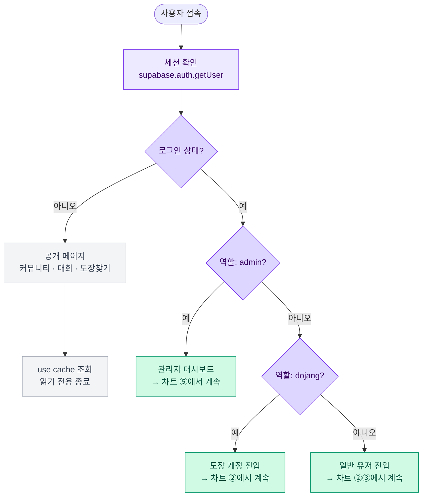
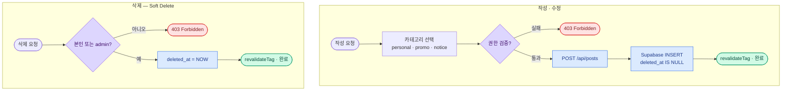
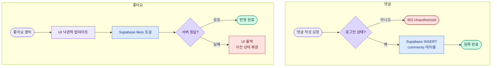
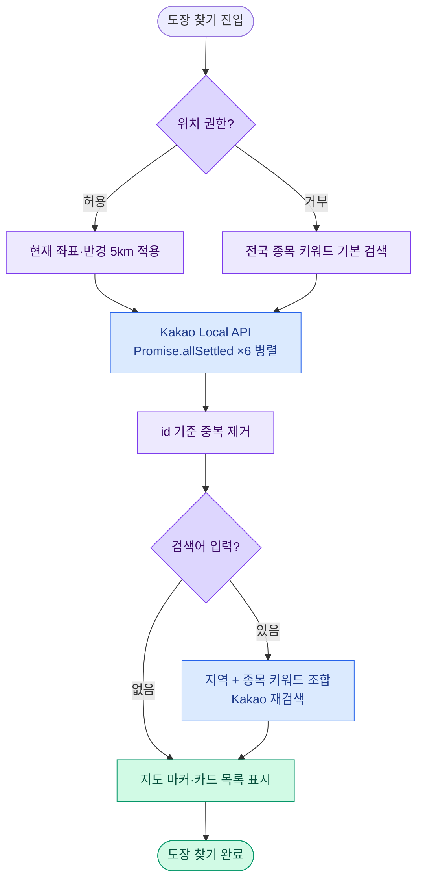
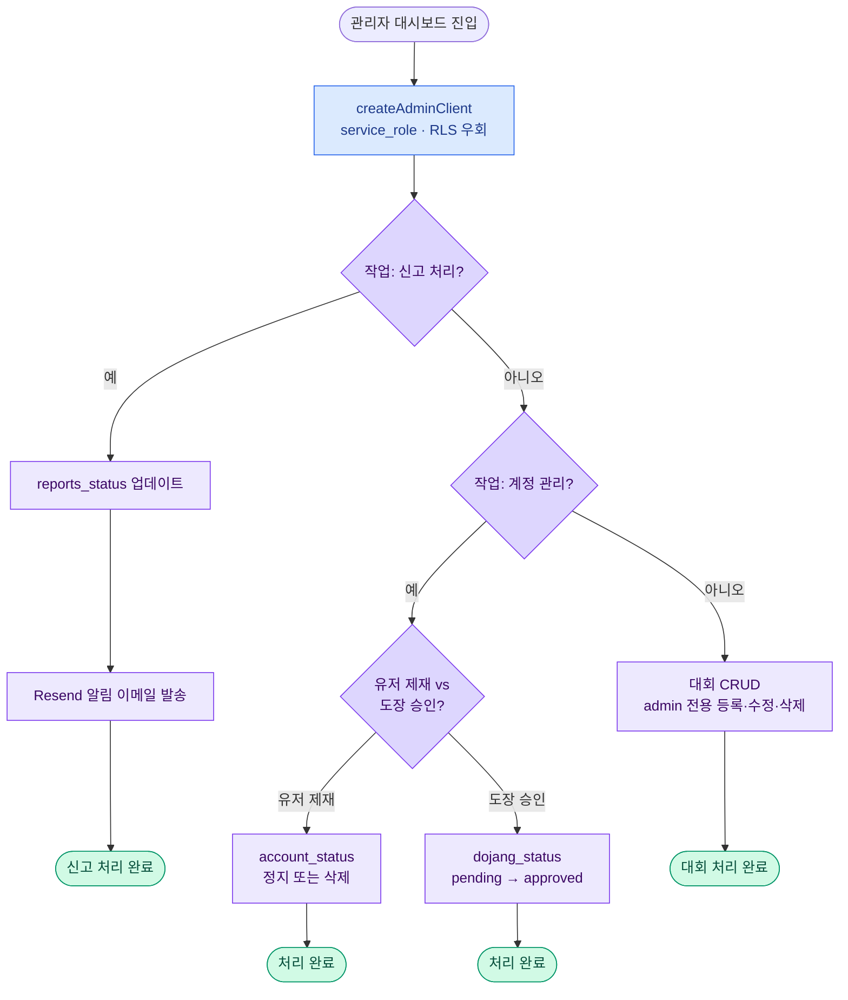
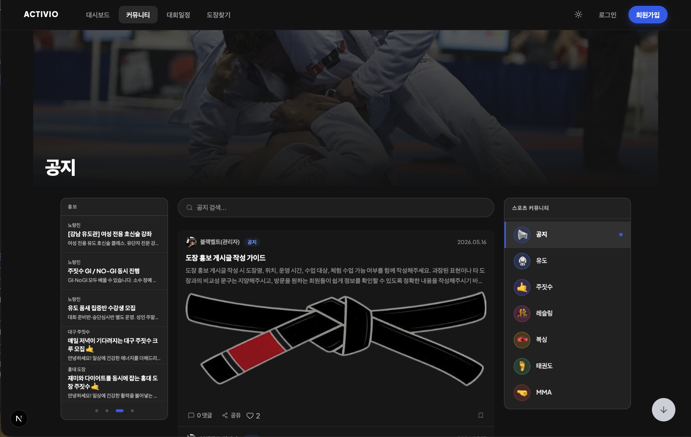
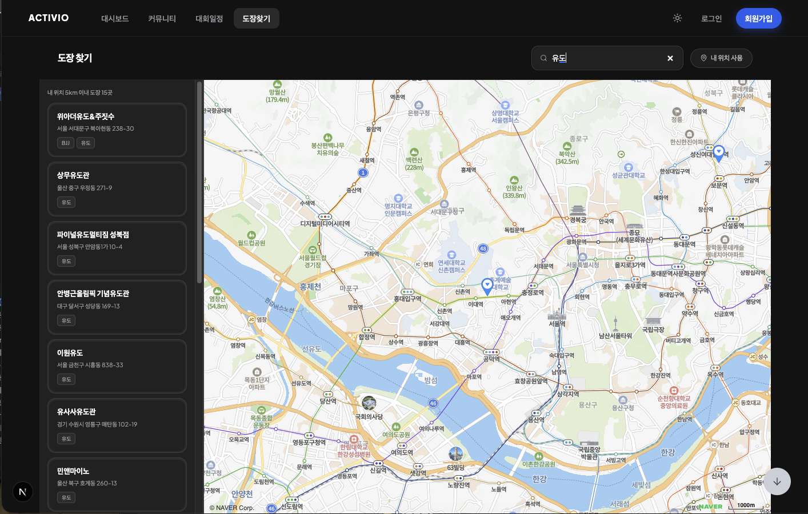
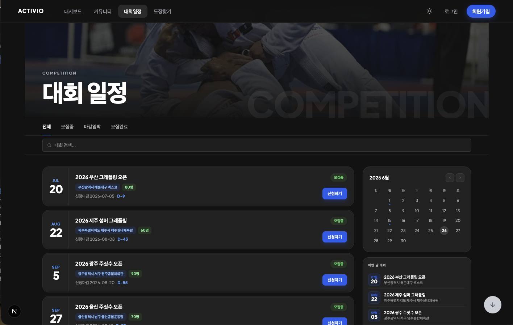
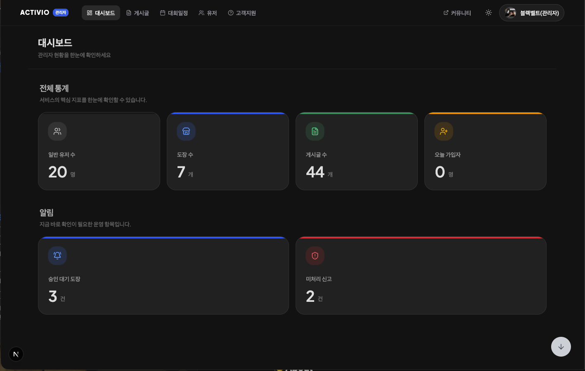
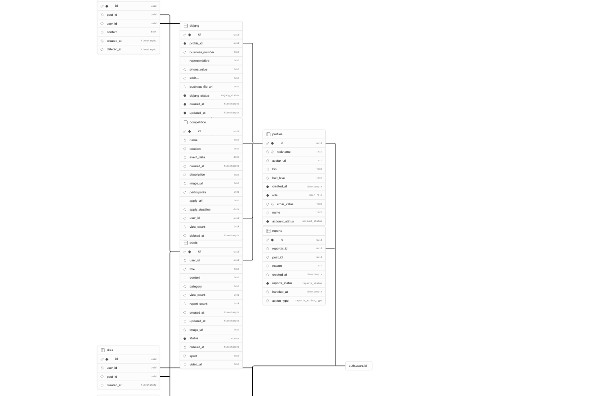

# Activio

> 유도, 주짓수, 레슬링, 복싱, 태권도, MMA — 모든 무술 종목 수련자, 도장, 코치를 하나의 공간에서 연결하는 스포츠 커뮤니티 플랫폼

배포 링크: https://activio-red.vercel.app/

---

## 개발 배경

무술을 배우고 싶어도 어디서 시작해야 할지 막막한 경험이 있었습니다. 도장을 찾으려면 지인에게 묻거나 검색 결과를 일일이 확인해야 했고, 막상 찾아가도 어떤 코치가 어떤 수업을 하는지 사전에 알 방법이 없었습니다.

수련자 입장에서 불편했던 건 두 가지였습니다. 하나는 정보 분산입니다. 유도·주짓수·복싱처럼 종목이 다르면 커뮤니티가 완전히 다른 곳에 흩어져 있어 공통 관심사를 가진 사람끼리 교류하기 어려웠습니다. 다른 하나는 검증 수단의 부재입니다. 도장의 실력과 분위기는 직접 방문하기 전까지 확인할 방법이 없었고, 초보자일수록 선택 기준이 없어 잘못된 곳에 등록하는 일이 반복됐습니다.

도장 운영자 쪽에서도 고충이 있었습니다. 홍보 채널이 없어 수련생을 모집하기 위해 각종 플랫폼을 개별 관리해야 했고, 대회 정보나 공지를 수련생에게 빠르게 전달하는 공식 수단이 없었습니다.

개발을 공부하면서 이 문제들을 시스템으로 풀어보고 싶었습니다. 종목별 커뮤니티에서 수련 경험과 기술을 공유하고, 도장이 홍보 게시글로 직접 수련생에게 다가가며, 대회 일정까지 한 곳에서 확인할 수 있다면 무술 생태계의 정보 비대칭이 줄어들 것이라고 봤습니다. Activio는 거기서 출발했습니다.

---

## 프로젝트 소개

| 항목      | 내용                                    |
| --------- | --------------------------------------- |
| 배포 URL  | https://activio-red.vercel.app/ |
| 개발 기간 | 2026.04 ~ 진행 중                       |
| 개발 인원 | 4인 (프론트엔드)                        |

**테스트 계정**

| 역할      | 이메일          | 비밀번호   |
| --------- | --------------- | ---------- |
| 일반 유저 | user@test.com   | test1234!  |
| 도장 계정 | dojang@test.com | test1234!  |
| 관리자    | admin@test.com  | admin1234! |

**팀원 소개**

| 이름   | 역할                                                                              | GitHub                                             |
| ------ | --------------------------------------------------------------------------------- | -------------------------------------------------- |
| 사민재 | 환경설정·DB 구성·커뮤니티·대회일정·도장찾기·헤더·캐싱 최적화·접근성 개선·리디자인 | [@smj123432-lab](https://github.com/smj123432-lab) |
| 문유정 | 피그마 목업 제작·발표·게시글·공유·댓글                                            | [@myj9713-dev](https://github.com/myj9713-dev)     |
| 이정론 | 관리자 페이지 (유저 관리·도장 승인·대회 일정)                                     | [@holymolyRon](https://github.com/holymolyRon)     |
| 이찬미 | 로그인·아이디/비밀번호 찾기·마이페이지                                            | [@lcmbook55](https://github.com/lcmbook55)         |

---

## 비즈니스 로직 플로우

### ① 인증 · 역할 분기



### ② 게시글 CRUD



### ③ 댓글 · 좋아요



### ④ 도장 찾기



### ⑤ 관리자 플로우



---

## 주요 기능 시연

### A. 종목별 커뮤니티 — 게시글 CRUD · 미디어 업로드 · 무한 스크롤



`/community/sport/[slug]` 경로로 종목별(유도·주짓수·레슬링·복싱·태권도·MMA) 커뮤니티를 나눴습니다. 로그인한 사람은 텍스트·이미지·동영상 게시글을 쓸 수 있고, 댓글·좋아요·북마크로 반응합니다. 목록은 TanStack Query `useInfiniteQuery`로 무한 스크롤하고, 검색창은 0.5초 디바운스를 걸어 키워드 검색과 카테고리 필터를 붙였습니다.

도장 계정(`role = 'dojang'`)은 `category = 'promo'` 홍보글을 쓸 수 있고, 해당 글은 커뮤니티 좌측 `PromoAdSidebar`에 최대 5개·4초 자동 슬라이드로 뜹니다.

### B. 도장 찾기 — 카카오 지도 · 종목별 키워드 병렬 검색



카카오 Maps API로 지도를 그리고, 카카오 Local API로 도장을 찾습니다. 진입 시 유도·주짓수·복싱·MMA·레슬링·태권도 6개 키워드를 동시에 날려 `id` 기준으로 중복을 제거한 뒤 전국 도장을 기본으로 올립니다. 위치 권한이 있으면 반경 5km 결과로 자동 전환됩니다. 검색창은 디바운스 검색으로 지역명·종목명 조합 쿼리를 날립니다.

`NEXT_PUBLIC_` 접두사가 붙은 환경변수는 번들에 그대로 실려 나가므로, 카카오 REST API 키는 서버 전용 환경변수로 격리하고 API Route로만 통하게 했습니다.

### C. 대회 일정 — 등록 · 상세 · 신청 링크



대회는 admin만 등록·수정·삭제할 수 있습니다. 목록은 모집 상태(모집중·마감임박·모집완료) 탭과 무한 스크롤로 보여주고, 탭 상태는 URL 쿼리 파라미터로 유지합니다. 삭제는 Soft Delete(`deleted_at` 업데이트)로 처리하고, 조회할 때는 항상 `deleted_at IS NULL` 필터를 겁니다.

### D. 관리자 시스템 — 유저 제재 · 도장 승인 · 신고 처리



`AdminTopNav` 아래 게시글 관리·유저 관리·대회 관리·고객지원·대시보드 5개 섹션이 있습니다. 유저 정지·계정 삭제는 `service_role` 키를 쓰는 `createAdminClient()`로 RLS를 우회해 처리합니다. 도장 승인은 `dojang_status`를 `pending → approved`로 바꾸고, 신고가 접수되면 Resend로 관리자 이메일 알림을 보냅니다.

관리자 테이블은 URL 쿼리 파라미터로 상태를 관리하고 Supabase `.range()`로 서버 페이지네이션합니다.

---

## 기술 스택

**프레임워크 · 언어**

-000000?style=flat-square&logo=next.js&logoColor=white)


| 기술                 | 선택 이유                                                                                                           |
| -------------------- | ------------------------------------------------------------------------------------------------------------------- |
| Next.js (App Router) | `use cache` 디렉티브 + `revalidateTag`로 공개 데이터를 정적 캐싱하고, 인증 데이터는 Suspense 스트리밍으로 분리 처리 |
| TypeScript (strict)  | 역할 타입(`user`\|`dojang`\|`admin`), 게시글 카테고리, 운동 종목 슬러그 등 도메인 규칙을 타입 레벨에서 강제         |
| React 19             | 서버/클라이언트 컴포넌트 경계를 명확히 하여 TTI 최적화                                                              |

**스타일**


| 기술            | 선택 이유                                                                                                        |
| --------------- | ---------------------------------------------------------------------------------------------------------------- |
| Tailwind CSS v4 | `@custom-variant light`로 라이트 모드 오버라이드 구현, CSS 변수 토큰 기반 테마 시스템으로 하드코딩 없이 유지보수 |

**백엔드 · 데이터베이스**


| 기술                  | 선택 이유                                                                                    |
| --------------------- | -------------------------------------------------------------------------------------------- |
| Supabase (PostgreSQL) | RLS 정책으로 역할별 데이터 접근을 DB 레벨에서 통제, CHECK 제약으로 허용되지 않은 상태값 차단 |
| Supabase Auth         | 이메일 기반 인증, 세션·토큰 관리, 역할별 분기 처리                                           |
| Supabase Storage      | 게시글 이미지·동영상, 사업자등록증, 대회 이미지 버킷 분리 관리                               |

**상태 관리**


| 기술              | 선택 이유                                                                                       |
| ----------------- | ----------------------------------------------------------------------------------------------- |
| TanStack Query v5 | 무한 스크롤(`useInfiniteQuery`), 낙관적 업데이트(좋아요), `HydrationBoundary`로 SSR 워터폴 방지 |
| Zustand           | 인증 상태·모달 등 전역 UI 상태 관리, `useAuthStore` 단일 구독으로 불필요한 리렌더 방지          |
| Zod               | 폼 스키마를 `schemas/`에 정의하고 `z.infer<>`로 TypeScript 타입과 동기화                        |

**인프라 · 도구**


| 기술            | 선택 이유                                                                             |
| --------------- | ------------------------------------------------------------------------------------- |
| Vercel          | main 브랜치 자동 배포, Edge Network CDN, 환경변수 격리                                |
| Kakao Maps API  | 국내 도로명 주소 정확도가 높고 지도 렌더링·마커 연동이 용이                           |
| Kakao Local API | 키워드 기반 장소 검색, REST API 키를 서버 전용 환경변수로 분리해 클라이언트 노출 차단 |
| Resend          | 신고 접수 알림 이메일 자동 발송                                                       |

---

## 데이터베이스 설계 (ERD)



**설계 의도**

`posts.sport` 컬럼에 종목 슬러그(NULL 허용)를 두고 공지(`notice`)와 종목별 게시글을 한 테이블로 관리합니다. 종목 커뮤니티 조회 시 `sport = 'slug'`로 걸러내고, 공지는 `sport IS NULL`로 따로 뽑습니다.

`profiles.belt_level` 컬럼은 원래 띠 단계용이었는데, DB 마이그레이션 없이 운동 종목 슬러그를 임시로 넣어두고 있습니다. 명시적인 `sport` 컬럼으로 분리하는 게 맞고, 개선 항목에 올려뒀습니다.

게시글·댓글·대회는 row를 실제로 지우지 않고 `deleted_at`만 업데이트합니다. 조회 쿼리 어디서든 `deleted_at IS NULL` 필터가 빠지면 삭제된 데이터가 그대로 내려갑니다.

---

## 핵심 비즈니스 로직

### 1. 3-tier Supabase 클라이언트 분리

`use cache` 스코프 안에서는 `cookies()`를 호출할 수 없어 인증 클라이언트를 사용하지 못합니다. 목적별로 클라이언트를 세 가지로 분리해 이 제약을 해결했습니다.

```typescript
// lib/supabase/public.ts  — cookies() 없음, use cache 스코프에서 사용 가능
// lib/supabase/server.ts  — cookies() 있음, 인증 필요 서버 컴포넌트
// lib/supabase/admin.ts   — service_role key, RLS 우회 (서버 전용)

export function createAdminClient() {
  return createClient(
    process.env.NEXT_PUBLIC_SUPABASE_URL!,
    process.env.SUPABASE_SERVICE_ROLE_KEY!, // NEXT_PUBLIC_ 없음 — 클라이언트 번들 미포함
  );
}
```

| 클라이언트       | cookies | use cache | 용도                            |
| ---------------- | :-----: | :-------: | ------------------------------- |
| `supabasePublic` |  없음   |   가능    | 커뮤니티·대회·도장 공개 데이터  |
| `supabaseServer` |  있음   |   불가    | 마이페이지·글 작성 등 인증 필요 |
| `supabaseAdmin`  |  없음   |     —     | 패널티 부여·도장 승인·신고 처리 |

### 2. `use cache` + `revalidateTag` 캐싱 전략

공개 데이터는 서비스 파일을 `.server.ts`로 분리하고 `use cache` 디렉티브를 적용합니다. 데이터 변경 시 `revalidateTag`로 즉시 무효화합니다.

```typescript
// services/communityService.server.ts
export async function getPosts(page?: number, pageSize?: number) {
  'use cache';
  cacheTag('posts-list');
  cacheLife('minutes');

  const supabase = createPublicSupabaseClient();
  return supabase
    .from('posts')
    .select('*, profiles(*), comments(count)')
    .is('deleted_at', null)
    .eq('status', 'published')
    .order('created_at', { ascending: false });
}

// API Route에서 캐시 무효화
revalidateTag('posts-list');
revalidateTag(`post-${id}`);
```

### 3. Soft Delete 패턴

게시글·댓글·대회 삭제는 실제 row를 제거하지 않고 `deleted_at` 컬럼을 업데이트합니다.

```typescript
// 삭제 — deleted_at 업데이트
await supabase
  .from('posts')
  .update({ deleted_at: new Date().toISOString() })
  .eq('id', id);

// 조회 — deleted_at IS NULL 필터 필수
await supabase.from('posts').select('*').is('deleted_at', null);
```

### 4. 역할 기반 접근 제어 (RBAC)

Supabase RLS 정책으로 DB 레벨에서 역할별 접근을 통제합니다.

| 기능                | user | dojang | admin |
| ------------------- | :--: | :----: | :---: |
| 게시글 조회         |  ✅  |   ✅   |  ✅   |
| 일반 게시글 작성    |  ✅  |   ✅   |  ✅   |
| 홍보 게시글 작성    |  ❌  |   ✅   |  ✅   |
| 공지 작성           |  ❌  |   ❌   |  ✅   |
| 타인 게시글 삭제    |  ❌  |   ❌   |  ✅   |
| 대회 등록·수정      |  ❌  |   ❌   |  ✅   |
| 관리자 페이지       |  ❌  |   ❌   |  ✅   |
| 유저 제재·도장 승인 |  ❌  |   ❌   |  ✅   |

### 5. 댓글 Race Condition 방지

클라이언트 레벨 쿨타임 체크는 `Promise.all`로 동시 요청이 들어오면 모두 통과하는 Race Condition이 발생합니다.

```typescript
// 1단계: API Route로 이전 — 서버에서 쿨타임·중복 검사 후 INSERT
// 2단계: DB 트리거(check_comment_cooltime)로 INSERT 자체를 막아 Race Condition 완전 차단
// 3단계: 텍스트 정규화로 invisible 문자·공백·대소문자 우회 차단
function normalize(text: string): string {
  return text
    .replace(/[​‌­]/g, '') // invisible 문자 제거
    .replace(/\s/g, '')
    .toLowerCase();
}
```

---

## 성능 최적화 · 코드 품질

### 서버 컴포넌트 캐싱

커뮤니티 목록·대회·도장찾기 같은 공개 데이터는 `supabasePublic` + `use cache`로 올려두고, 글을 쓰거나 수정·삭제할 때만 `revalidateTag`로 해당 태그를 날립니다. 마이페이지·글 작성처럼 인증이 필요한 데이터는 캐시 없이 매 요청마다 새로 가져옵니다.

### `` → `next/image` 교체

9곳에서 ``를 직접 쓰고 있어 lazy loading·WebP 변환·사이즈 최적화가 빠져 있었습니다. `next/image`로 바꾸고 `fill`·`priority`·`sizes`를 각 위치에 맞게 지정했더니 `/community` Lighthouse Performance가 65점 → 74점으로 올랐습니다.

### 낙관적 업데이트

좋아요 기능은 TanStack Query `onMutate`에서 캐시를 먼저 갱신하고 서버 응답을 기다립니다. 실패 시 `onError`에서 이전 상태로 자동 복원됩니다.

```typescript
useMutation({
  mutationFn: toggleLike,
  onMutate: async ({ postId, liked }) => {
    await queryClient.cancelQueries({ queryKey: ['posts'] })
    const previous = queryClient.getQueryData(['posts'])
    queryClient.setQueryData(['posts'], (old) => /* optimistic update */)
    return { previous }
  },
  onError: (_err, _vars, context) => {
    queryClient.setQueryData(['posts'], context?.previous)
  },
})
```

### 접근성 위반 33건 → 0건

axe-core로 전수 점검했더니 ARIA 패턴 critical 4건, 중복 landmark serious 4건, WCAG AA 색상 대비 미달 serious 25건이 나왔습니다. `role="tablist"` 수정, landmark 구조 재설계, 색상 토큰 재조정으로 33건 전부 잡았고 Lighthouse Accessibility 100점을 찍었습니다.

### 컴포넌트 중복 코드 추출·통합

작성·수정·목록 컴포넌트 6개에 같은 로직이 복붙되어 있었고 합치면 1,054줄이었습니다. `PostFormBase`·`CompetitionFormBase` 공통 컴포넌트와 `useCommunityListState` 훅으로 뽑아낸 뒤 6개 파일 합계가 1,054줄 → 532줄(-49.5%)로 줄었습니다.

---

## 보안 설계

### Supabase RLS (Row Level Security)

역할별 데이터 접근 제어를 DB 레벨에서 처리합니다. 클라이언트가 직접 Supabase를 호출하더라도 RLS 정책이 없으면 접근할 수 없습니다.

- `posts` 테이블: 공개 게시글은 누구나 읽을 수 있지만 등록은 인증 사용자만 가능
- `profiles` 테이블: 본인 행만 UPDATE 가능
- 패널티 부여·도장 승인처럼 RLS를 우회해야 하는 작업은 `createAdminClient()`를 통해 API Route 서버 환경에서만 처리

### API Route 인증 및 필드 주입 차단

모든 데이터 변경 API Route는 요청 초입에 `supabase.auth.getUser()`로 세션을 검증하고, 세션이 없으면 즉시 401을 반환합니다. 요청 바디는 허용된 필드만 명시적으로 destructure합니다.

```typescript
// 변경 전: body 전체 spread → 임의 필드 주입 가능
const body = await request.json();
supabase.from('posts').insert({ ...body, user_id: user.id });

// 변경 후: 허용된 필드만 destructure
const { title, content, category, sport, image_url } = await request.json();
supabase
  .from('posts')
  .insert({ title, content, category, sport, image_url, user_id: user.id });
```

### 환경변수 관리

카카오 REST API 키는 `KAKAO_REST_API_KEY`로 서버 전용 환경변수에 저장합니다. `NEXT_PUBLIC_` 접두사가 붙은 환경변수는 브라우저 번들에 포함되기 때문에, 클라이언트가 직접 호출하는 대신 API Route를 프록시로 사용합니다.

---

## 기술적 도전 및 트러블슈팅

### 1. Soft Delete 필터 누락 — 삭제 데이터 응답 포함

**문제**: API 3곳에서 `deleted_at IS NULL` 필터가 빠져 있어 삭제된 게시글·댓글이 응답에 섞여 나왔습니다

**해결**: `api/posts`, `api/comments`, `api/comments/[id]` 조회 쿼리 전체에 `.is('deleted_at', null)` 필터를 추가했습니다. 삭제 데이터 노출 0건으로 차단됐습니다

### 2. admin 콘텐츠 관리 권한 오류

**문제**: `user·dojang·admin` 역할 시스템에서 admin이 다른 사용자 게시글을 삭제할 때 권한 오류가 발생했습니다. 역할을 중첩 조건으로 체크하다가 admin 분기가 제대로 걸리지 않은 것이 원인이었습니다

**해결**: `contentPermissions.ts`의 `canManageContent` 함수를 `currentUserRole === 'admin' || currentUserId === authorUserId` 단순 조건으로 정리해 admin이 모든 역할의 콘텐츠를 관리할 수 있도록 했습니다

### 3. SSR initialData → queryKey 직렬화로 인한 불필요한 refetch

**문제**: `useCommunity`·`useCompetition`에서 SSR initialData를 `JSON.stringify`로 직렬화한 값을 queryKey에 넣었습니다. 마운트마다 참조가 달라져 TanStack Query가 캐시 미스로 판단하고 API를 재요청했습니다

**해결**: queryKey를 `['posts']`·`['competition']` 고정 문자열로 바꾸고 `initialDataUpdatedAt`을 상수로 처리해 마운트 시 불필요한 refetch를 없앴습니다

---

## 폴더 구조

```
src/
├── actions/                       # Server Actions
│   ├── admin/                     # 관리자 액션 (posts, users, dojang, reports, competitions)
│   └── competition/
│
├── app/
│   ├── (admin)/admin/             # 관리자 전용
│   │   ├── competitions/
│   │   ├── posts/
│   │   ├── support/
│   │   └── users/
│   ├── (auth)/                    # 인증
│   │   ├── find-password/
│   │   ├── login/
│   │   └── register/
│   ├── (main)/                    # 메인 서비스
│   │   ├── community/
│   │   │   ├── [slug]/            # 게시글 상세·수정
│   │   │   │   └── edit/
│   │   │   ├── sport/[sport]/     # 종목별 커뮤니티·작성
│   │   │   │   └── write/
│   │   │   └── write/            # 공지 작성
│   │   ├── competitions/
│   │   │   ├── [slug]/
│   │   │   │   └── edit/
│   │   │   └── write/
│   │   ├── dashboard/
│   │   ├── dojangs/               # 도장 찾기 (Kakao Maps)
│   │   └── mypage/
│   ├── api/                       # Route Handlers
│   │   ├── check-nickname/
│   │   ├── comments/[id]/
│   │   ├── delete-account/
│   │   ├── posts/[id]/
│   │   ├── register/              # 일반 회원가입
│   │   ├── register-dojang/
│   │   ├── reports/
│   │   └── reset-password/
│   └── home/
│
├── components/
│   ├── admin/                     # AdminTopNav, 관리자 테이블·액션
│   │   ├── competitions/
│   │   ├── dashboard/
│   │   ├── posts/
│   │   ├── support/
│   │   └── users/
│   ├── common/                    # ConfirmModal, SearchInput, Field 등
│   ├── community/                 # PostCard, PostFormBase, PromoAdSidebar
│   ├── competition/               # CompetitionCard, CompetitionFormBase
│   ├── dashboard/
│   ├── dojang/                    # DojangClient (Kakao Maps)
│   ├── error/
│   ├── home/
│   ├── layout/                    # TopNav, Sidebar, Footer
│   ├── mypage/
│   └── ui/                        # shadcn/ui 기반
│
├── hooks/
│   ├── useAuth.ts
│   ├── useBookmark.ts
│   ├── useCommunity.ts            # TanStack Query 래핑
│   ├── useCommunityListState.ts   # 목록 필터·검색 상태 공통 훅
│   ├── useCompetition.ts
│   ├── useDebounce.ts             # 0.5초 검색 디바운스
│   ├── useInfiniteScroll.ts       # IntersectionObserver
│   ├── useLike.ts                 # 낙관적 업데이트
│   └── useMyPage.ts
│
├── lib/
│   ├── supabase/
│   │   ├── client.ts              # 브라우저용
│   │   ├── server.ts              # 서버 컴포넌트용 (cookies)
│   │   └── public.ts              # 공개 데이터용 (use cache 호환)
│   ├── CommentAbuseGuard.ts       # 댓글 어뷰징 방지
│   ├── contentPermissions.ts      # 역할별 콘텐츠 권한
│   ├── auth.ts
│   └── reportNotificationEmail.ts
│
├── services/
│   ├── communityService.ts        # 클라이언트용 CRUD
│   ├── communityService.server.ts # 서버용 (use cache)
│   ├── competitionService.ts
│   ├── competitionService.server.ts
│   ├── authService.ts
│   ├── bookmarkService.ts
│   ├── reportService.ts
│   └── userService.ts
│
├── store/
│   └── authStore.ts               # Zustand 인증 상태
│
├── constants/                     # sports, routes, adminMeta, categoryMap 등
├── types/                         # TypeScript 타입 정의
└── utils/                         # formatDate, timeAgo, share
```

---

## 실행 방법

**필수 환경변수 (`.env.local`)**

```env
NEXT_PUBLIC_SUPABASE_URL=
NEXT_PUBLIC_SUPABASE_ANON_KEY=
SUPABASE_SERVICE_ROLE_KEY=
NEXT_PUBLIC_KAKAO_MAP_KEY=
KAKAO_REST_API_KEY=
NEXT_PUBLIC_KAKAO_LOCAL_API_KEY=
RESEND_API_KEY=
ADMIN_REPORT_EMAIL=
REPORT_EMAIL_FROM=
```

**개발 서버 실행**

```bash
npm install
npm run dev
```

**타입 체크**

```bash
npm run type-check
```

**프로덕션 빌드**

```bash
npm run build
```

---

## v3 업데이트 예정

| 기능                                       | 설명                                                                                            |
| ------------------------------------------ | ----------------------------------------------------------------------------------------------- |
| `profiles.belt_level` 컬럼 마이그레이션    | 운동 종목을 저장하기 위해 `belt_level` 컬럼을 재활용 중 — 명시적인 `sport` 컬럼으로 분리 필요  |
| 인기글 정렬                                | 좋아요·조회수 기반 인기글 탭 추가                                                               |
| 소셜 로그인                                | Google·Kakao OAuth 연동                                                                         |
| 도장 리뷰 시스템                           | 수련생이 도장에 평점과 후기를 남기는 기능                                                       |
| `getCompetitions()` 클라이언트 서비스 구현 | 현재 서버 사이드(`lib/getCompetitions.ts`)로만 처리 중인 목록 조회를 클라이언트 서비스로도 구현 |

